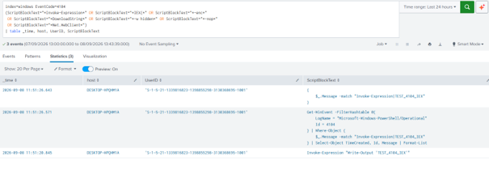
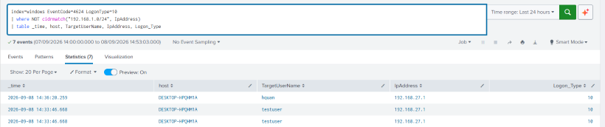
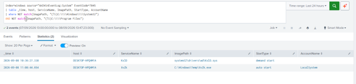
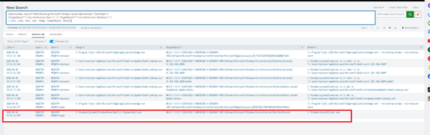
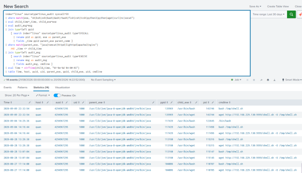
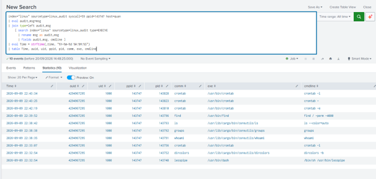
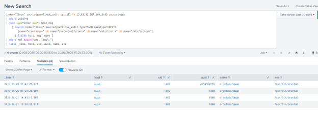

# Splunk SIEM: Detection Lab

A self-study lab that implements detections for a set of anomalous behaviors on **Windows** and **Linux** hosts, using **Splunk Enterprise** as the SIEM.

## Table of Contents

- [Collection Model](#collection-model)
  - [Log Sources](#log-sources)
  - [Windows Forwarder Configuration](#windows-forwarder-configuration)
  - [Linux Forwarder Configuration](#linux-forwarder-configuration)
- [Detections](#detections)
  - [Windows](#windows)
    - [1. Suspicious PowerShell Execution](#1-suspicious-powershell-execution)
    - [2. RDP Logon from an Unusual IP](#2-rdp-logon-from-an-unusual-ip)
    - [3. New Service Installed](#3-new-service-installed)
    - [4. Registry Run Key Added](#4-registry-run-key-added)
  - [Linux](#linux)
    - [5. Web Server or Interpreter Spawning a Dangerous Command](#5-web-server-or-interpreter-spawning-a-dangerous-command)
    - [6. New Cron Job Created by a Non-root User](#6-new-cron-job-created-by-a-non-root-user)

---

## Collection Model

- **SIEM:** Splunk Enterprise
- **Forwarders:** Splunk Universal Forwarder on each endpoint

### Log Sources

| Host | Log source | Splunk index | Sourcetype |
| --- | --- | --- | --- |
| Windows | Security event log | `windows` | `WinEventLog:Security` |
| Windows | System event log | `windows` | `WinEventLog:System` |
| Windows | Application event log | `windows` | `WinEventLog:Application` |
| Windows | Sysmon (`Microsoft-Windows-Sysmon/Operational`) | `windows` | `WinEventLog:Sysmon` |
| Ubuntu | `auditd` (`/var/log/audit/audit.log`) | `linux` | `linux_audit` |
| Ubuntu | `/var/log/auth.log` | `linux` | `linux_secure` |
| Ubuntu | `/var/log/syslog` | `linux` | `syslog` |
| Ubuntu | Cron files (`/etc/crontab`, `/etc/cron.d/*`, `/var/spool/cron/crontabs/*`) | `linux` | `cron_file` |

### Windows Forwarder Configuration

`inputs.conf`

```ini
[WinEventLog://Security]
disabled = false
renderXml = true
index = windows
sourcetype = WinEventLog:Security

[WinEventLog://System]
disabled = false
renderXml = true
index = windows
sourcetype = WinEventLog:System

[WinEventLog://Application]
disabled = false
renderXml = true
index = windows
sourcetype = WinEventLog:Application

[WinEventLog://Microsoft-Windows-Sysmon/Operational]
disabled = false
renderXml = true
index = windows
sourcetype = WinEventLog:Sysmon
```

### Linux Forwarder Configuration

**Forwarder inputs** — `inputs.conf`

```ini
[monitor:///var/log/auth.log]
disabled = false
index = linux
sourcetype = linux_secure

[monitor:///var/log/syslog]
disabled = false
index = linux
sourcetype = syslog

[monitor:///var/log/audit/audit.log]
disabled = false
index = linux
sourcetype = linux_audit

[monitor:///etc/crontab]
disabled = false
index = linux
sourcetype = cron_file

[monitor:///etc/cron.d/*]
disabled = false
index = linux
sourcetype = cron_file

[monitor:///var/spool/cron/crontabs/*]
disabled = false
index = linux
sourcetype = cron_file
```

**Audit rules** — `/etc/audit/audit.rules`

```text
## This file is automatically generated from /etc/audit/rules.d
-D
-b 8192
-f 1
--backlog_wait_time 60000
-a always,exit -F arch=b64 -S execve
-a always,exit -F arch=b32 -S execve
-a always,exit -F arch=b64 -S connect
-w /etc/cron.d/ -p wa -k cron_change
-w /var/spool/cron/crontabs/ -p wa -k cron_change
```

> **Splunk Add-ons installed:** `Splunk_TA_microsoft-sysmon` (Windows) and `Splunk_TA_nix` (Linux) are installed on the Splunk Enterprise to handle parsing and field normalization for both platforms.

**Search-time field extraction** — `/opt/splunk/etc/apps/search/local/props.conf`

`auditd` `EXECVE` records only carry the raw arguments (`a0`, `a1`, ...). This `EVAL` rebuilds a `cmdline` field from `a0`–`a5` (i.e., commands with fewer than 6 arguments) and URL-decodes any argument that `auditd` hex-encoded.

```ini
[linux_audit]
EVAL-cmdline = mvjoin(mvappend( \
    if(match(coalesce(a0,""),"^[0-9A-Fa-f]+$"), urldecode(replace(a0,"([0-9A-Fa-f]{2})","%\1")), coalesce(a0,"")), \
    if(match(coalesce(a1,""),"^[0-9A-Fa-f]+$"), urldecode(replace(a1,"([0-9A-Fa-f]{2})","%\1")), coalesce(a1,"")), \
    if(match(coalesce(a2,""),"^[0-9A-Fa-f]+$"), urldecode(replace(a2,"([0-9A-Fa-f]{2})","%\1")), coalesce(a2,"")), \
    if(match(coalesce(a3,""),"^[0-9A-Fa-f]+$"), urldecode(replace(a3,"([0-9A-Fa-f]{2})","%\1")), coalesce(a3,"")), \
    if(match(coalesce(a4,""),"^[0-9A-Fa-f]+$"), urldecode(replace(a4,"([0-9A-Fa-f]{2})","%\1")), coalesce(a4,"")), \
    if(match(coalesce(a5,""),"^[0-9A-Fa-f]+$"), urldecode(replace(a5,"([0-9A-Fa-f]{2})","%\1")), coalesce(a5,"")) \
), " ")
```

---

## Detections

| # | Detection | Platform | MITRE ATT&CK | Key event / source |
| --- | --- | --- | --- | --- |
| 1 | Suspicious PowerShell execution | Windows | T1059.001 | `EventCode=4104` |
| 2 | RDP logon from an unusual IP | Windows | T1021.001 | `EventCode=4624`, `Logon_Type=10` |
| 3 | New service installed | Windows | T1543.003 | `EventCode=7045` |
| 4 | Registry Run key added | Windows | T1547.001 | Sysmon `EventCode=13` |
| 5 | Web server or interpreter spawning a dangerous command | Linux | T1190 | `auditd` `SYSCALL` (`syscall=59`, `execve`) |
| 6 | New cron job created by a non-root user | Linux | T1053.003 | `auditd` `SYSCALL` / `PATH` |

---

## Windows

### 1. Suspicious PowerShell Execution

**Detected behavior:** PowerShell execution using techniques commonly seen in obfuscation and download-and-execute chains (`Invoke-Expression`, encoded commands, downloads from the Internet). This is an indicator of fileless malware, droppers, or post-exploitation activity.

**MITRE ATT&CK:** T1059.001 (Command and Scripting Interpreter: PowerShell)

**Event ID / log source:** `EventCode=4104` (PowerShell Script Block Logging)

**Detection query**

```spl
index=windows EventCode=4104
(ScriptBlockText="*Invoke-Expression*" OR ScriptBlockText="*IEX(*" OR ScriptBlockText="*-enc*"
 OR ScriptBlockText="*DownloadString*" OR ScriptBlockText="*-w hidden*" OR ScriptBlockText="*-nop*"
 OR ScriptBlockText="*Net.WebClient*")
| table _time, host, UserID, ScriptBlockText
```



**False positives:** Internal administration and automation scripts (deployment scripts, DSC, module updates) legitimately use `Invoke-Expression` or `-enc`.


### 2. RDP Logon from an Unusual IP

**Detected behavior:** An interactive remote (RDP) logon from a source IP that is not within the known internal or VPN ranges. This can indicate lateral movement, external brute-forcing, or compromised credentials.

**MITRE ATT&CK:** T1021.001 (Remote Services: Remote Desktop Protocol)

**Event ID / log source:** `EventCode=4624` with `Logon_Type=10`

**Detection query**

```spl
index=windows EventCode=4624 LogonType=10
| where NOT cidrmatch("192.168.1.0/24", IpAddress)
| table _time, host, TargetUserName, IpAddress, Logon_Type
```



**Tuning:** Improve rule quality by comparing `Source_Network_Address` against a lookup table of known VPN and office IP ranges, rather than only excluding private ranges.

**False positives:**

- Remote/WFH employees connecting over RDP through a VPN that uses a legitimate public IP outside the private-range allowlist.
- ISP NAT can cause a branch office's IP to be flagged if it has not been added to the lookup table.

---

### 3. New Service Installed

**Detected behavior:** Installation of a new Windows service, commonly used for persistence or privilege escalation.

**MITRE ATT&CK:** T1543.003 (Create or Modify System Process: Windows Service)

**Event ID / log source:** `EventCode=7045` (System log)

**Indicator:** `Service_File_Name` points to an unusual path (`Temp`, `AppData`, `Users\Public`, `ProgramData`), combined with `Service_Start_Type=auto start`.

**Detection query**

```spl
index=windows source="XmlWinEventLog:System" EventCode=7045
| table _time, host, ServiceName, ImagePath, StartType, AccountName
| where NOT match(ImagePath, "(?i)C:\\\\Windows\\\\System32")
AND NOT match(ImagePath, "(?i)C:\\\\Program Files")
```



**False positives:** Legitimate software installers (drivers, antivirus, backup agents, internal software) also register services outside `System32` during installation. Whitelist known publishers/paths or combine the rule with a digital-signature check on the binary.

---

### 4. Registry Run Key Added

**Detected behavior:** A process writes a new value to a registry key that lets a program launch automatically at system startup or user logon, which indicates persistence being established.

**MITRE ATT&CK:** T1547.001 (Boot or Logon Autostart Execution: Registry Run Keys / Startup Folder)

**Scope:** This lab only simulates detection for the following locations:

- `HKCU\Software\Microsoft\Windows\CurrentVersion\Run` and `RunOnce`
- `HKLM\Software\Microsoft\Windows\CurrentVersion\Run` and `RunOnce`

**Event ID / log source:** Sysmon (`Microsoft-Windows-Sysmon/Operational`), `EventCode=13` (Registry value set), with `TargetObject` matching one of the keys above.

**Detection query**

```spl
index=windows source="XmlWinEventLog:Microsoft-Windows-Sysmon/Operational" EventCode=13
(TargetObject="*\\CurrentVersion\\Run\\*" OR TargetObject="*\\CurrentVersion\\RunOnce\\*")
| table _time, host, User, Image, TargetObject, Details
```




**Tuning:** Improve rule quality by alerting only when:

- `Image` is `powershell.exe`, `cmd.exe`, `wscript.exe`, or `mshta.exe`, or
- `Details` points to a user-writable directory (`%TEMP%`, `%APPDATA%`),

instead of alerting on every autostart value.

**False positives:**

- Many legitimate applications register themselves to start with the system through these keys. In the results, `msedge.exe` writing `MicrosoftEdgeAutoLaunch_*` values is a typical example.
- Installers and updaters (Teams, OneDrive, Zoom, Google Update) can also be flagged unless they are whitelisted by `Image` and `TargetObject` pair.

---

## Linux

### 5. Web Server or Interpreter Spawning a Dangerous Command

**Detected behavior:** A web/application server or interpreter (`apache2`, `nginx`, `php-fpm`, `node`, `python`, `java`, ...) spawns a dangerous command such as `/bin/sh`, `curl`, `wget`, or `socat`. This is a typical sign of web shell activity or remote code execution.

**MITRE ATT&CK:** T1190 (Exploit Public-Facing Application)

**Log source:** `auditd`, `type=SYSCALL`, `syscall=59` (`execve`)

**Detection logic**

1. Find `execve` events whose `exe` field is an executable that a web server should not spawn (`/bin/sh`, `curl`, `wget`, `socat`, ...).
2. Join with the parent process's log entry (`ppid` = parent `pid`) to check that the parent's `exe` is a web server or interpreter.
3. Optionally join on the `msg` field of the `SYSCALL` record to retrieve `cmdline` from the `type=EXECVE` record. The `msg` value is the shared event ID across all record types of a single `auditd` event.

`EXECVE` records only contain raw arguments, so `cmdline` is assembled by the `EVAL-cmdline` extraction in [`props.conf`](#linux-forwarder-configuration) (for commands with fewer than 6 arguments).

**Detection query**

```spl
index="linux" sourcetype=linux_audit syscall=59
| where match(exe, "sh|ksh|zsh|bash|dash|rbash|fish|csh|tcsh|python3|python|wget|curl|nc|socat")
| eval child_time=_time, child_exe=exe
| eval audit_msg=msg
| join type=left ppid
    [ search index="linux" sourcetype=linux_audit type=SYSCALL
      | rename pid as ppid, exe as parent_exe
      | fields _time ppid parent_exe parent_comm ]
| where match(parent_exe, "java|tomcat|httpd|lighttpd|apache2|nginx")
    AND _time <= child_time
| join type=left audit_msg
    [ search index="linux" sourcetype=linux_audit type=EXECVE
      | rename msg as audit_msg
      | fields audit_msg, cmdline ]
| eval Time = strftime(child_time, "%Y-%m-%d %H:%M:%S")
| table Time, host, auid, uid, parent_exe, ppid, child_exe, pid, cmdline
```



**Follow-up: tracing the attacker's shell**

For a shell spawned by the attacker, trace the process tree with `child's ppid = shell's pid` to see what the attacker is doing with it.

```spl
index="linux" sourcetype=linux_audit syscall=59 ppid=143747 host=quan
| eval audit_msg=msg
| join type=left audit_msg
    [ search index="linux" sourcetype=linux_audit type=EXECVE
      | rename msg as audit_msg
      | fields audit_msg, cmdline ]
| eval Time = strftime(_time, "%Y-%m-%d %H:%M:%S")
| table Time, auid, uid, ppid, pid, comm, exe, cmdline
```



---

### 6. New Cron Job Created by a Non-root User

**Detected behavior:** A process with an `auid` other than root writes to cron paths through the `open`, `openat`, `creat`, `rename`, `renameat`, or `renameat2` syscalls.

**MITRE ATT&CK:** T1053.003 (Scheduled Task/Job: Cron)

**Log source:** `auditd`, `type=SYSCALL`, with watch rules on the paths where cron files are stored (see [audit rules](#linux-forwarder-configuration): `-w /etc/cron.d/ -p wa -k cron_change` and `-w /var/spool/cron/crontabs/ -p wa -k cron_change`).

**Syscall reference (x86_64)**

| Syscall | Number |
| --- | --- |
| `open` | 2 |
| `rename` | 82 |
| `creat` | 85 |
| `openat` | 257 |
| `renameat` | 264 |
| `renameat2` | 316 |

**Detection query**

```spl
index="linux" sourcetype=linux_audit syscall IN (2,85,82,257,264,316) success=yes
| where auid!=0
| join type=inner max=1 host msg
    [ search index="linux" sourcetype=linux_audit type=PATH nametype=CREATE
        (name="crontabs/*" OR name="/var/spool/cron/*" OR name="/etc/cron.*" OR name="/etc/crontab")
      | fields host, msg, name ]
| where NOT match(name, "tmp\.")
| table _time, host, uid, auid, name, exe
```



**False positives:**

- Service accounts or applications that register cron jobs themselves during installation.
- Legitimate edits made by users through `crontab` also match the rule, so the job content must be reviewed.
